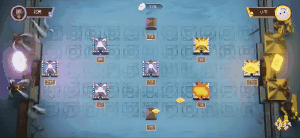

# Decisivebattle
> 决战大明宫（策略对战游戏）


## Demo



## Core 核心逻辑

### 图像队列预加载
```JavaScript
const preload = (images) => {
  const core = (e) => {
    new Promise(resolve => {
      const img = new Image()
      img.src = e
      img.onload = resolve
    })
    return Promise.all(images.map(async img => core(img)))
  }
}
// 用例
await preload(['a.jpg','b.jpg'])
```

### 对象池
```JavaScript
let pool = [];
let pooling = [];
function geneBullet(pool) {
    const bullet = document.createElement('span');
    bullet.className = 'bullet';
    pool.push(bullet)
}
async function launch(player, from, target, during) {
    // mock
    // during = 1000;
    // player = {blue: true};
    // from = [300, 100];
    // target = [100, 600];
    // 判断池量
    const poolNum = pool.length;
    if (poolNum <= 0) geneBullet(pool);

    // 初始化子弹
    const color = player.blue ? 'blue' : 'red';
    const styleFrom = `background:${color};display: inline-block;transition: transform ${during}ms ease-in, opacity .3s ease;transform: translate(${from.join('px,')}px);opacity: 1;`;
    const styleTarget = `background:${color};display: inline-block;transition: transform ${during}ms ease-in, opacity .3s ease;transform: translate(${target.join('px,')}px);opacity: 1;`;
    const bullet = pool.pop();
    bullet.setAttribute('style', styleFrom);
    setTimeout(() => bullet.setAttribute('style', styleTarget), 50);
    // 装载子弹
    if (poolNum <= 0) {
        const root = document.querySelector('.root');
        await root.appendChild(bullet);
    }
    // 卸载子弹
    setTimeout(() => {
        bullet.setAttribute('style', '');
        // setTimeout(() => bullet.setAttribute('style', styleFrom));
        pool.push(bullet);
    }, during + 50)
    //
}
```

### 音效管理
```JavaScript
let audios = [];
let audioIndex = 0;
let audioSize = 10;

function play() {
    audios[audioIndex].play();
    audioIndex++;
    console.log(audioIndex);
    if (audioIndex >= audioSize) audioIndex = 0
}

function geneAudios() {
    for (let i = 0; i < audioSize; i++) {
        const audio = new Audio();
        audio.src = './demo2.mp3';
        audios.push(audio)
    }
    console.log(audios)
}

geneAudios()
```
### 滑动检测
```JavaScript
coord(dom) {
    let rect = dom.getBoundingClientRect()
    if (this.isiOS) return [dom.offsetLeft + dom.clientWidth / 2, dom.offsetTop + dom.clientHeight / 2]
    return [rect.x + dom.clientWidth / 2, rect.y + dom.clientHeight / 2]
}
```
### websock 实时通信
```JavaScript
/**
 * 发起 ws 数据包
 * @param {object} data - 主体数据
 * @param {Function} onMessage - ws 接收数据回调
 * @param {number} [timeout] - 自定义超时时间, 当不传入时默认使用当前实例 options 中的 timeout
 * @returns {Promise<any>}
 */
send(data, {onMessage, timeout} = {}) {
    const {ws} = this;
    let timeoutHook;
    /**
     * 监听 websocket 数据回调
     * @param resolve
     * @param reject
     */
    let onMessageListener;
    /**
     * 回收 onMessage 监听器
     * @returns {*}
     */
    const recycleOnMessageListener = () => ws.removeEventListener('message', onMessageListener);
    /**
     * 当 promise 结束后执行
     */
    const onPromiseComplete = () => {
        recycleOnMessageListener();
        clearTimeout(timeoutHook)
    };
    const promise = new Promise((resolve, reject) => {
        ws.send(JSON.stringify(data));
        timeoutHook = this.createTimeout(reject, timeout);
        if (onMessage) {
            onMessageListener = (event) => this.createOnMessageListener(event, onMessage, {resolve, reject});
            ws.addEventListener('message', onMessageListener);
        } else {
            resolve();
        }
    });
    promise.then(onPromiseComplete, onPromiseComplete);
    return promise;
}
```

## Install
```bash
yarn install && yarn start
```
